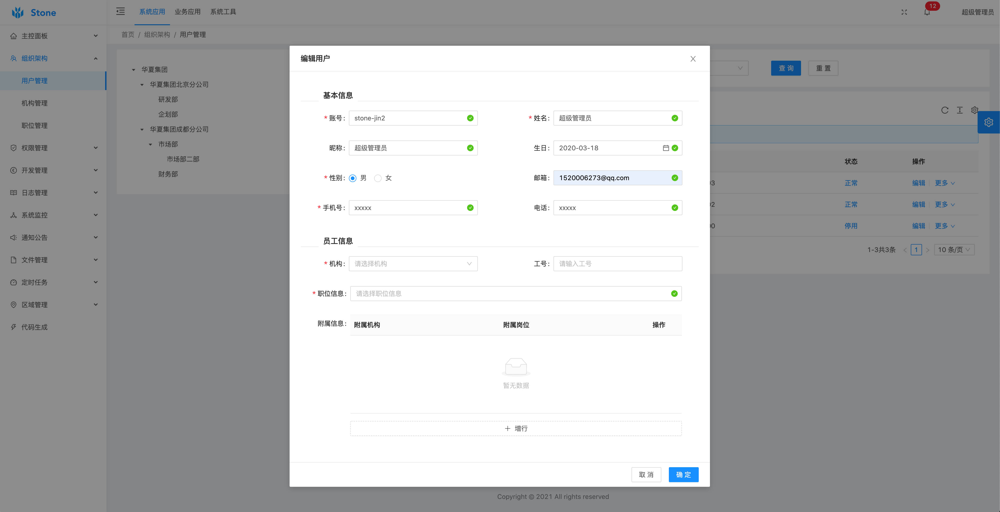
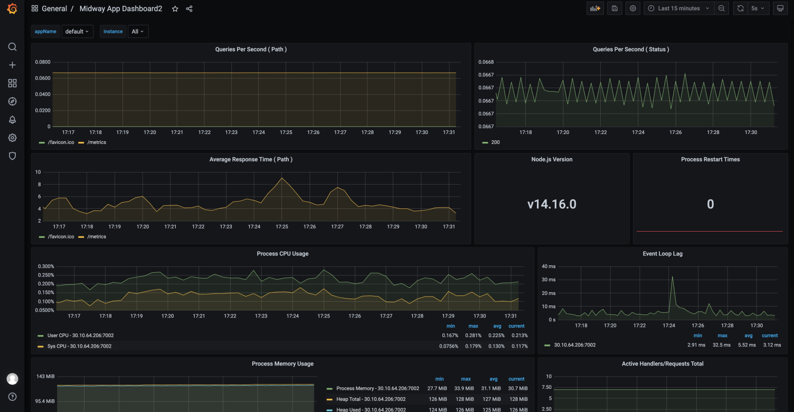
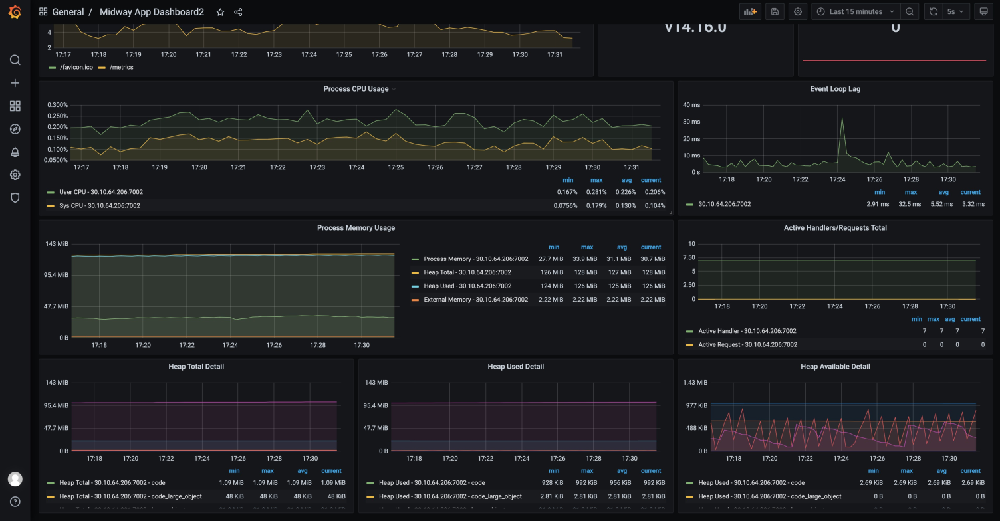
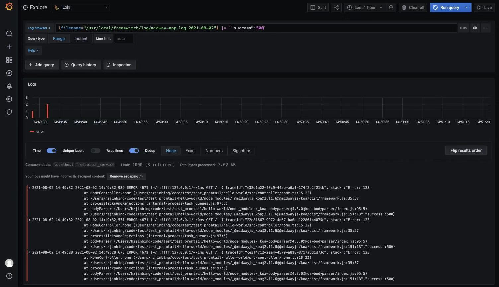

## stone
Stone 是基于 Midway(NodeJS) + and design vue 的一套中后台解决方案，目前用于个人开发中后台项目使用。

前端部分是基于开源项目 小诺 进行迭代。

能力介绍：
- 组织架构
- RBAC权限
- 业务功能
  - 低代码搭建平台
- 系统监控
  - QPS监控
  - Node相关指标监控
  - 日志运维
- 三方服务
  - 邮件发送
  - 短信发送
- 部署方式
  - CI 通过 gitlab runner
  - K8S + docker 部署
- 服务能力
  - 基于etcd进行服务注册与发现
  - Nacos进行配置管理
  - 定时任务基于：Bull

### 项目效果

### 系统监控

指标监控：

### 日志监控

日志监控:

### 链路跟踪

